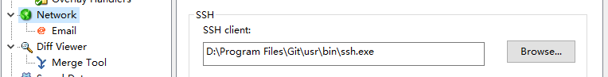

### 1.安装Git
在Windows上安装Git

Windows下要使用很多Linux/Unix的工具时，需要Cygwin这样的模拟环境，Git也一样。Cygwin的安装和配置都比较复杂，就不建议你折腾了。不过，有高人已经把模拟环境和Git都打包好了，名叫msysgit，只需要下载一个单独的exe安装程序，其他什么也不用装，绝对好用。

msysgit是Windows版的Git，从https://git-for-windows.github.io下载（网速慢的同学请移步国内镜像），然后按默认选项安装即可。

安装完成后，在开始菜单里找到“Git”->“Git Bash”，蹦出一个类似命令行窗口的东西，就说明Git安装成功！
```
install-git-on-windows
```
安装完成后，还需要最后一步设置，在命令行输入：

```
$ git config --global user.name "Your Name"
$ git config --global user.email "email@example.com"
```
> *这里配置的是全局的用户信息，如果要单个项目配置用户信息，只需要把global去掉即可*

因为Git是分布式版本控制系统，所以，每个机器都必须自报家门：你的名字和Email地址。你也许会担心，如果有人故意冒充别人怎么办？这个不必担心，首先我们相信大家都是善良无知的群众，其次，真的有冒充的也是有办法可查的。

注意git config命令的--global参数，用了这个参数，表示你这台机器上所有的Git仓库都会使用这个配置，当然也可以对某个仓库指定不同的用户名和Email地址。

### 2.遇到的一些问题的思考
第一次接触Git遇到好些问题，花了我不少的时间去解决，当然花费这么多时间的很大一个原因就是自己的English太差；毁不当初没学好啊。
在确定Git程序完全安装没有问题的话，如果在项目的commit,push,pull等操作中出现权限的问题，可以考虑：
1. 是否项目的用户信息跟全局的用户信息冲突
2. 为本机相关的github账号设置SSH

### git did not exit cleanly (exit code 128)  解决方案

我在clone,pull代码的时候有时候会遇到“git did not exit cleanly (exit code 128)”错误。通常都是网络原因。



1、鼠标右键 -> TortoiseGit -> Settings -> Network

2、SSH client was pointing to C:\Program Files\TortoiseGit\bin\TortoisePlink.exe

3、Changed path to C:\Program Files (x86)\Git\usr\bin\ssh.exe