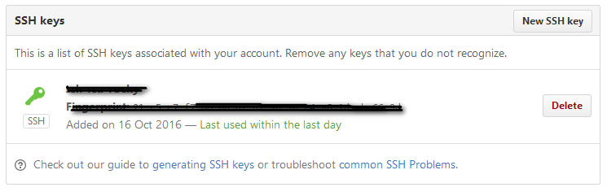

### 一台电脑中git管理多个github仓库账户


参考：
* [http://www.cnblogs.com/xjnotxj/p/5845574.html](http://www.cnblogs.com/xjnotxj/p/5845574.html)
* [http://www.cnblogs.com/wwolf/p/5717060.html](http://www.cnblogs.com/wwolf/p/5717060.html)

`目的`：公司有github账号，自己有github账号，想在git上同时使用，两者互不干扰。  
`方法`：管理两个SHH key。

### 一、生成两个SSH key ###


为了举例方便，这里使用“one”和“two”两个账户。下同。

```
$ ssh-keygen -t rsa -C "one@gmail.com"
$ ssh-keygen -t rsa -C "two@gmail.com"
```

`注1`：ssh-keygen是linux命令，可以让两个机器之间使用ssh而不需要用户名和密码  
`注2`：一定要在~/.ssh路径下运行命令行，不然生成的文件不会出现在当前目录

### 二、添加私钥 ###


(1)如果你是github官方的bash：
```
$ ssh-agent -s
```
(2) 如果你是其它，比如msysgit：
```
$ eval $(ssh-agent -s)
```

(3) 添加私钥
```
$ ssh-add ~/.ssh/id_rsa_one

$ ssh-add ~/.ssh/id_rsa_two
``` 

###  三、创建config文件 ###


```
$ touch config
```

此时会出现空的config文件，然后添加如下内容：
```
# one(one@gmail.com)

    Host one.github.com

　　HostName github.com

　　PreferredAuthentications publickey

　　IdentityFile ~/.ssh/id_rsa_one

　　User one

 

# two(two@ gmail.com)

    Host two.github.com

　　HostName github.com

　　PreferredAuthentications publickey

　　IdentityFile ~/.ssh/id_rsa_two

　　User two
```
### 四、部署SSH key ###


分别登陆两个github账号，进入Personal settings –> SSH and GPG keys：

### 五、使用 ###


1、clone到本地

(1)原来的写法：
```
$ git clone git@github.com: one的用户名/learngit.git
```
(2)现在的写法：
```
$ git clone git@one.github.com: one的用户名/learngit.git

$ git clone git@two.github.com: two的用户名/learngit.git
```

2、记得给这个仓库设置局部的用户名和邮箱：
```
$ git config user.name "one_name" ; git config user.email "one_email"

$ git config user.name "two_name" ; git config user.email "two_email"
```

3、上述都成功后，会发现钥匙会由灰变绿。


