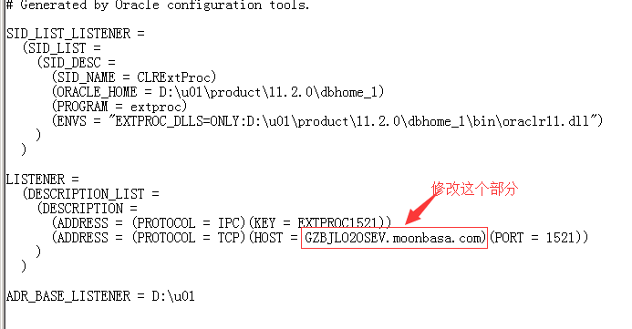

1.修改`listener.ora`和`tnsnames.ora`两个文件
进入`$ORACLE_HOME\NETWORK\ADMIN` 修改`listener.ora`和`tnsnames.ora`两个文件，把这两个文件里面内容`host`名部分，由原来旧`HOST`更改为新的`HOST`名 ；如图：

----------

----------

2.进入`$ORACLE_HOME\oc4j\j2ee`修改文件夹名：
把 `OC4J_DBConsole_$oldhost_orcl` 文件夹更改名为 `OC4J_DBConsole_$newhost_orcl`，这里`$host`是指你的新旧计算机名：

----------

----------

3.修改注册表:
左下角开始—搜索程序和程序名--输入`regedit`回车打开注册表，找到`HKEY_LOCAL_MACHINE-software-oracle`右键后查找`host`关键字，然后更新为新的主机名；

----------

----------

4.检查确保oracle服务已设置为自动启动：

----------

5.最后重启测试即可。 

